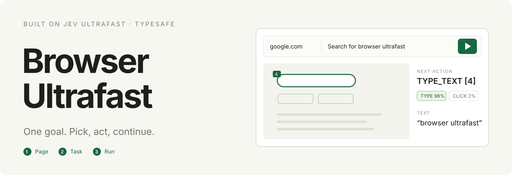
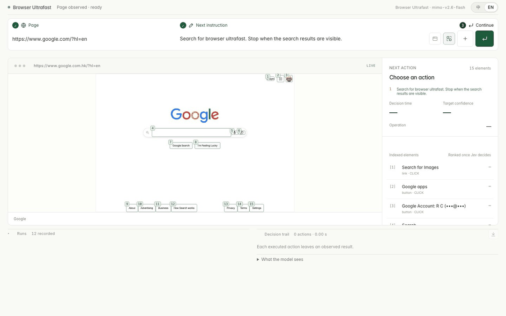

# Browser Ultrafast ⚡

> [!NOTE]
> Browser Ultrafast is derived from **[Jev Ultrafast](https://github.com/browser-use/jev-ultrafast)** by [Browser Use](https://github.com/browser-use), released under the MIT license. It keeps the upstream agent loop and adds a local inspector with a three-step command box, chained instructions on one page, a run history with replay and delete, and fixes for controls the upstream executor could not reach. The Python package and the `jev` command keep their upstream names.

**A browser agent with a dynamic, indexed action space.**

Give it one goal. [TypeSafe's Jev](https://docs.typesafe.ai/introduction) picks an operation and an element. A small LLM writes text only when the operation is `TYPE_TEXT`.

<a href="docs/demo.mp4"></a>

The recording above is one real run in the inspector, played at 1×: a Google search in **2 actions and 18.5 seconds**. Most of that time is model latency on this machine: the first Jev decision took 6.2 s and the text helper (`mimo-v2.6-flash`) 8.8 s; the second decision took 0.8 s. The profile's e-mail address is masked in the footage.

[Watch the MP4](docs/demo.mp4) · [Upstream measurements](docs/performance.md) · [Read the loop](jev_ultrafast/agent.py)

## The action space

Every observation produces a new element table:

```text
[1] button    Change ticket type · Round trip
[2] combobox  Where from?        · San Francisco
[3] combobox  Where to?          · empty
[4] textbox   Departure          · empty
...
```

The operations are `CLICK`, `TYPE_TEXT`, `SELECT`, `SCROLL_UP`, `SCROLL_DOWN`, `WAIT`, `DONE`, and `BLOCKED`. Only supported operations and targets are offered.

```text
                      one TypeSafe request
                     ┌───────────────────────────┐
page → element table → operation                 │
                     │ click_target              │
                     │ type_text_target          │
                     │ select_target, if present │
                     └─────────────┬─────────────┘
                         use the matching target
                                   │
                    CLICK [7] ─────┤──→ browser
                TYPE_TEXT [3] ─────┘
                          ↓
                   small LLM → text → browser
```

Target questions are speculative. If the operation is `CLICK`, only `click_target` can execute. Two decisions, **one network round trip**. Each target head contains only compatible elements. Native dropdown choices carry an observed element/option index.

There are no site-specific action scripts or prepared field strings in the policy. The Flights example supplies a goal and independently verifies the outcome. The screenshot renderer adds labels afterward; it does not drive the browser.

## Try it

```bash
git clone https://github.com/ricardochen1996/jev-ultrafast.git
cd jev-ultrafast
uv sync
cp .env.example .env
# Add TYPESAFE_API_KEY and TEXT_MODEL_API_KEY.
uv run jev   # or: uv run browser-ultrafast
```

Open **http://127.0.0.1:8766** and follow the three numbered steps above the command box: ① the page address, ② the task, ③ the ▶ button (or Enter). The run continues automatically until it finishes; the button turns into a red ■ while it runs. A finished run stays open: the same box then takes the next instruction for that page (Enter or ↵). **NEW** (新建) starts a new task, and so does changing the address. The boxes icon next to **LIVE** above the preview shows or hides the numbered target boxes; hover any icon for its name. The inspector shows numbered elements, operation probabilities, target probabilities, and executed actions. **Runs** lists every recorded run: ↻ replays its instructions in order from the page where it began, and the bin deletes the record and its screenshot; deleting the run on screen also ends it and clears the console. The address, the goal, and the 中 / EN choice in the top bar are remembered in the browser.

Every run is stored under `artifacts/runs/` with its goal, actions, decisions, generated text, errors, and final screen. The **Runs** list on the same page reopens any of them after a restart, and each entry can be exported as JSON.

`TYPESAFE_BASE_URL` accepts any endpoint that speaks the System One protocol, so the hosted API is a default rather than a requirement: OpenCode's gateway serves the same request and response shape at `https://opencode.ai/zen/v1/systemone`. Chrome connects through [Browser Harness](https://github.com/browser-use/browser-harness), installed by `uv sync`. Run `uv run browser-harness --doctor` if it needs connecting. Allow remote debugging in Chrome when prompted.

`TEXT_MODEL_API_KEY` is an OpenRouter key in the example configuration. The upstream measurements used `inception/mercury-2.5` with reasoning disabled; the recording above used `mimo-v2.6-flash`. Gemini, GLM, and DeepSeek can also use the OpenAI-compatible text helper; configure the appropriate model, endpoint, and reasoning setting.

## Use the library

```python
from jev_ultrafast import Agent

with Agent(
    "https://www.google.com/travel/flights?hl=en",
    "Find one-way flights from Zurich to London on September 20, 2026, "
    "for one adult in economy. Stop when matching flight options are visible.",
) as agent:
    for state in agent.run():
        print(state["elapsed_ms"], state["status"])
```

Run with `uv run --env-file .env python your_script.py`. The same policy can run a different task:

```bash
uv run --env-file .env python examples/run.py \
  --url https://en.wikipedia.org/wiki/Main_Page \
  --goal 'Find and open the Wikipedia article about Gödel’s incompleteness theorems.'
```

`uv run --env-file .env python examples/flights.py --keep-open` performs the flight search, checks the actual route/date/results, and saves its trace. It does not select or book a flight.

## Why it moves

- **One request per decision cycle.** Operation and target heads share the same observed state.
- **No screenshots in the default agent loop.** Jev consumes structured state. The inspector opts into screenshots; the demo video captures the inspector page itself.
- **One browser call per snapshot.** Read visible controls, their names, values, and text atomically. Keep references to the actual DOM nodes.
- **Validate the selected target.** Clicks check the document, form values, target, and nearby context. Animation alone does not force another prediction. Resolve current geometry and reject covered controls before input.
- **Wait for useful state.** After typing into a combobox, wait for visible suggestions, capped at 200 ms. Other interactions get at most two animation frames or 50 ms. These reads happen after execution is logged.
- **Keep hidden tabs rendering.** Focus emulation prevents background animation throttling without switching Chrome's visible tab.
- **Send visible text.** Offscreen article bodies and footers do not fill the model context.
- **Reuse an interrupted text request.** A generated value survives a stale-page retry only if the entire text-helper input is unchanged.
- **Let the page finish.** After a click, typing, or a select, the loop reads the page until it stops changing, so an asynchronous render is not mistaken for a no-op.
- **Never repeat an action that just did nothing.** When the selected target already ran against the same element without moving the page, the next-best candidate from that same answer is used. The choice comes from the response already paid for, so the cycle still costs one request.
- **Explore before giving up.** `BLOCKED` is not accepted while the page is still moving, and if content remains below the fold the loop scrolls once and looks again. Scrolling follows the panel under the viewport centre, not only the window.

## Reaching the controls

Some interfaces put real controls where pointer input cannot land. The snapshot offers them anyway, and the executor handles each case from the observed node:

- **Clipped actions.** A control inside a container with `overflow: hidden` — an overflow menu, a pinned action column — is offered as its own target instead of only behind a trigger. A popup that a synthetic click cannot open no longer hides the actions it holds.
- **Custom selects.** A focusable box that names itself a picker is treated as a trigger, not a text field. Clicking aims at the free space after any chips, which is where a person clicks, and once the popup is open its option rows are offered as targets.
- **Wrapped links.** The box centre of a link that wraps across lines can fall between its lines, onto a neighbour. The executor aims at the element's own painted boxes and uses the first point the element itself receives.
- **New tabs.** A link with `target=_blank` opens another tab. When the driven tab opened it, the run continues there, like a person following the link. Unrelated tabs are never taken over.
- **One tab per launch.** The connection layer gives every caller its own tab, so the browser's startup tab is left over the moment a run begins. It is closed once the driven tab is on its page — never before, never if the browser holds nothing else, and never at all when it holds a page someone is reading.
- **Refused targets.** A target the executor refuses on an unchanged page is not offered again; the same answer's next-best candidate is used. After three refusals on one page the run stops instead of spinning.
- **Dialogs.** While a modal is on screen, `DONE` is refused: the page still has something to say. If the choice insists, the run reports `BLOCKED` rather than a success nobody has seen.

Only actions the snapshot itself marked as clipped may be activated through their own node. Everything else keeps the ordinary path: resolve current geometry, hit-test the point, and reject a covered control before input. Model output still never becomes selectors, coordinates, or code.

Every executed target is resolved from an observed node. The executor rechecks page freshness and click occlusion. Model output never becomes selectors, coordinates, shell commands, or executable JavaScript. Text-helper output must parse as a small JSON object before typing.

## Small enough to read

| File | Job |
| --- | --- |
| [agent.py](jev_ultrafast/agent.py) | The complete loop and text-helper handoff |
| [snapshot.js](jev_ultrafast/snapshot.js) | Atomic DOM snapshot, indexed controls, freshness guards |
| [browser.py](jev_ultrafast/browser.py) | Browser connection, current geometry, execution |
| [model.py](jev_ultrafast/model.py) | Dynamic operation/target heads and text generation |
| [questions.py](jev_ultrafast/questions.py) | Model instructions |
| [demo.py](jev_ultrafast/demo.py) | Local inspector |

## Evidence and limits

The figures in this section are the upstream project's, measured on its own build; they are not re-measured for this fork. Its [Google Flights video](https://github.com/browser-use/jev-ultrafast/blob/main/docs/demo.mp4) is a **7,073 ms** run. Timing starts after initial page observation and includes model calls, generated text, browser work, stale decisions, and loading waits. A fresh independent check verifies the one-way setting, Zürich, London, September 20, 2026, and visible flight options. The video plays at 1×, with no opening hold and a 0.5-second final hold.

In six alternating runs with identical models and settings, both versions passed **3/3**. Median task time went from **9.450 s → 7.092 s**, a **25% reduction**; median browser protocol calls went from **1,092 → 101**. This is three repeats of one task on one browser profile, not a general reliability benchmark.

The same policy opened the requested Wikipedia article in **2.798 s** and passed a local hotel search/filter task in **1.896 s**. Runs, failures, source hashes, and measurement boundaries are in [performance.md](docs/performance.md).

A `DONE` choice still requires independent outcome verification. A modal dialog on screen is treated as unfinished work rather than success. The DOM reader handles common HTML and ARIA controls, not the full accessible-name specification. Shadow roots, frames, canvas, uploads, pop-up tabs, and arbitrary keyboard widgets remain outside this MVP; nested scrolling is handled only for the panel under the viewport centre. Owned tabs share the existing Chrome profile.

Timings and request counts above were measured on the upstream build at commit `1231850`. The reachability and settling work described here runs after this fork's actions, so re-measure with `uv run python examples/flights.py` before quoting them.

## Development

```bash
uv run ruff check .
uv run pytest
node --check jev_ultrafast/static/app.js
node --check jev_ultrafast/snapshot.js
uv build
```

Tests are offline. `uv run python scripts/check_guards.py` checks real controls in a local browser without model calls. Live examples and recording scripts make paid API calls. `uv run --with imageio-ffmpeg python scripts/record_inspector.py <new-folder> --url … --goal …` records the inspector during one run, keeps each frame's capture time, masks e-mail addresses, and writes `docs/demo.gif`, `docs/demo.mp4`, and `docs/inspector.png` only when the run ends `done`. The upstream Flights footage came from `scripts/record_flights.py` and `scripts/render_demo.py`. Credentials and raw traces stay ignored.

---

[Browser Use](https://github.com/browser-use/browser-use) · [Browser Harness](https://github.com/browser-use/browser-harness) · [TypeSafe speculative fan-out](https://docs.typesafe.ai/patterns/fan-out)
